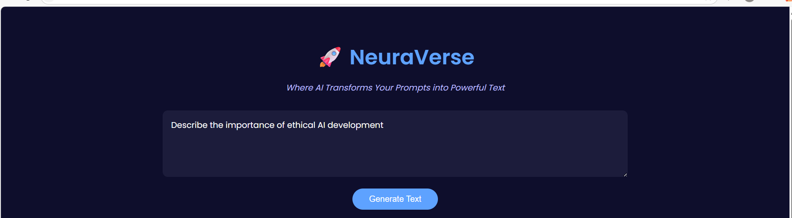
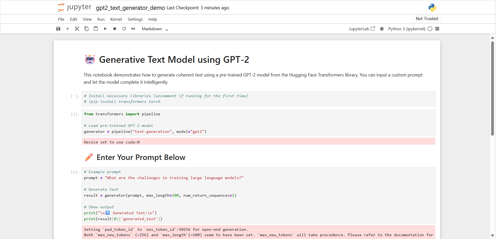
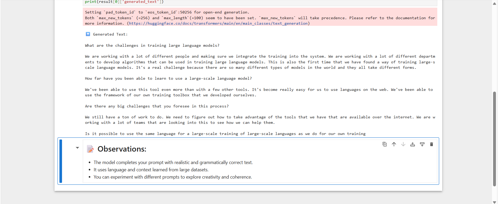

# 🧠 TEXT GENERATION TOOL – NeuraVerse (Flask Web + Notebook)

An intelligent tool for generating realistic text based on prompts using **GPT-2**, built with **Flask**, **Python**, and **Transformers**.

---

## 🏢 INTERNSHIP DETAILS

- **COMPANY**: CODTECH IT SOLUTIONS  
- **NAME**: JEMIMAH PRAISY  
- **INTERN ID**: CT04DG2504  
- **DOMAIN**: ARTIFICIAL INTELLIGENCE  
- **DURATION**: 4 WEEKS  
- **MENTOR**: NEELA SANTHOSH  

---

## ✨ FEATURES

- 🧠 Generate AI text using HuggingFace GPT-2
- 🌐 Web app built with Flask (NeuraVerse)
- 📓 Includes interactive Jupyter Notebook
- 💡 Clean and modern UI
- ⚡ Fast and responsive

---

## 📷 OUTPUT PREVIEW

### Web App


### Prompt: Web App2


### Jupyter Notebook


### Prompt: Notebook2



## 🚀 HOW TO RUN

### ▶️ Web App (Flask)

```bash
pip install -r requirements.txt
python app.py
